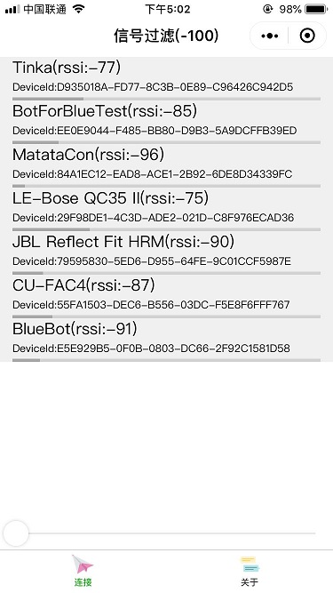
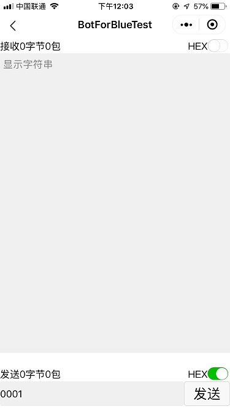

###界面如下，使用前先打开蓝牙，下滑启动扫描，点击连接就可以进行通信了

###安卓 IOS都可以使用，扫如下小程序码可以使用

###欢迎提交BUG，或加入一起开发
https://git.weixin.qq.com/tongjinlv/airauto.git

  
  
  

使用前需要把"appid": "wx366ce055828d4046",改成你自己的
    {
    	"description": "项目配置文件。",
    	"setting": {
    		"urlCheck": true,
    		"es6": true,
    		"postcss": true,
    		"minified": true,
    		"newFeature": true
    	},
    	"compileType": "miniprogram",
    	"libVersion": "2.8.2",
    	"appid": "wx366ce055828d4046",
    	"projectname": "lightblue",
    	"simulatorType": "wechat",
    	"simulatorPluginLibVersion": {},
    	"condition": {
    		"search": {
    			"current": -1,
    			"list": []
    		},
    		"conversation": {
    			"current": -1,
    			"list": []
    		},
    		"game": {
    			"currentL": -1,
    			"list": []
    		},
    		"miniprogram": {
    			"current": -1,
    			"list": []
    		}
    	}
    }