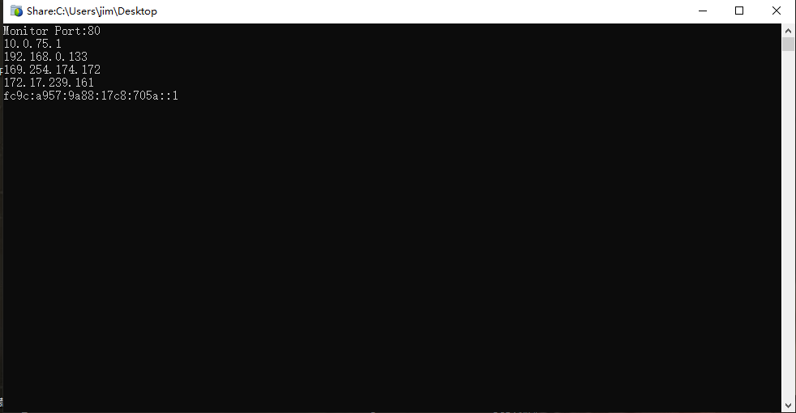

## 面对win的共享功能 时灵时不灵 很头疼，就做了一个局域网共享文件应用，实现的机理就是模拟web服务器共享本地文件，无任何依赖。##
###运行界面如下##

##在局域网内其他电脑登陆 当前电脑IP地址 即可访问，如无法访问一般关闭防火墙即可，如果80端口被占用，重新命名文件Sardir[81].exe 再次运行即可改变端口到81##

##下载地址 包含代码##
[Shardir.zip][3]
##使用C# 开发##

 

  
  
  [3]: http://typeecho.trtos.com/blog/typecho/Shardir.zip