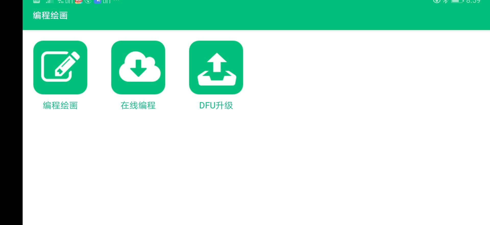
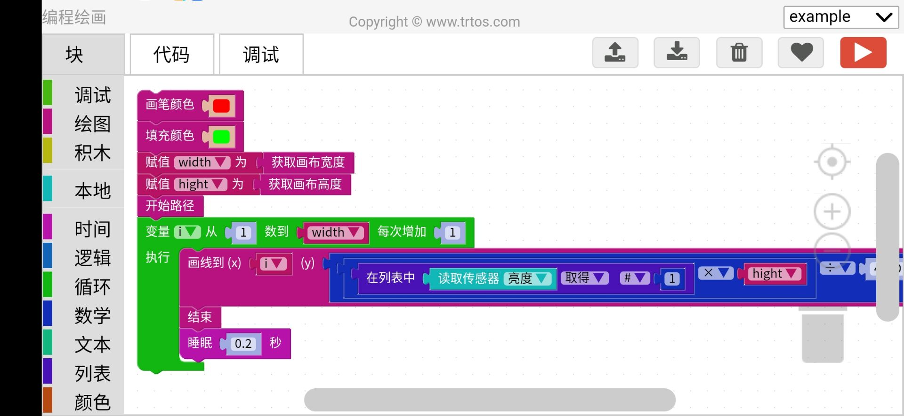
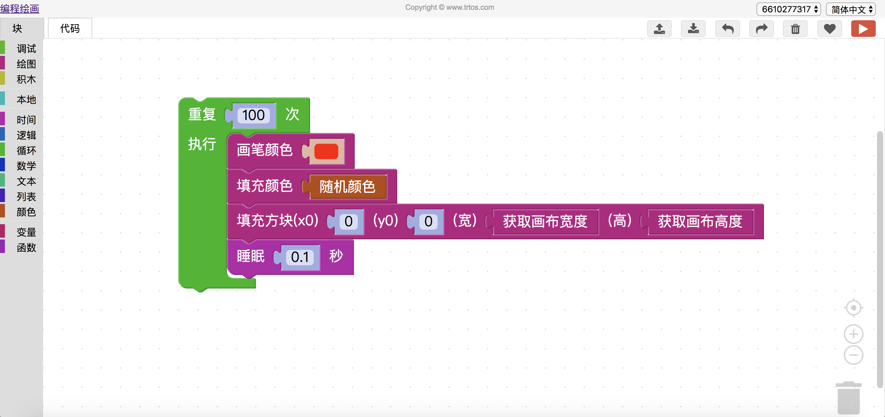

编程绘画 是一款 可单机可在线的编程系统，轻松的编程体验，终身免费。通过ID 绑定即可实现 在线web 编程 一键运行到安卓端
使用模式：

 1. 在线编程 安卓端绘画
 2. 安卓端编程，安卓端绘画
 3. A安卓端编程，B安卓端绘画

***[安卓端下载地址][2]***
程序截图

在线编程截图

【编程绘画】触摸的使用
[dplayer url="http://typeecho.trtos.com/blog/typecho/【编程绘画】触摸的使用.mp4" pic="http://typeecho.trtos.com/blog/typecho/FC93182F7A066F4376D1FFBCBBCEFD4B.jpg" danmu="false"/]
  [1]: http://typeecho.trtos.com/blog/typecho/%E5%B1%8F%E5%B9%95%E5%BF%AB%E7%85%A7%202020-05-11%20%E4%B8%8B%E5%8D%888.55.43.png
  [2]: http://trtos.com/php/download.php?name=drawcode
  
  
  [5]: http://typeecho.trtos.com/blog/typecho/1589203166886868.mp4