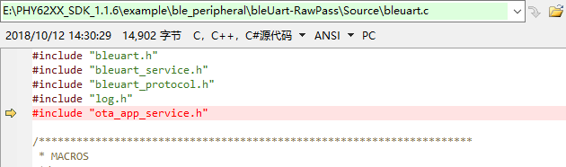
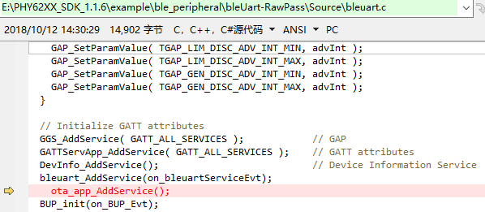
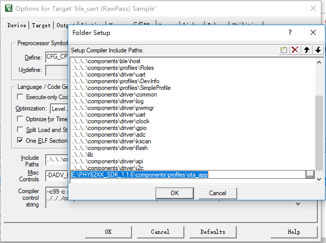
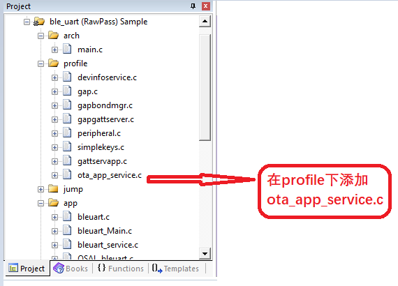
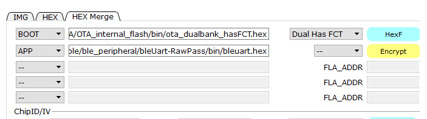

以SDK1.1.6中的uart透传程序为例，添加ota功能需要以下步骤：
1、添加头文件

2、添加ota服务

3、Include Paths中添加components\\profiles\\ota_app

4、在项目里面加ota_app_service.c

5、编译后烧录

BOOT项中的hex文件可以在…\\example\\OTA\\OTA_internal_flash\\bin中找到。
6、烧录完成后就可以在手机上安装PHYAPP对开发板进行升级了。（升级的hex文件请放在手机的根目录下）