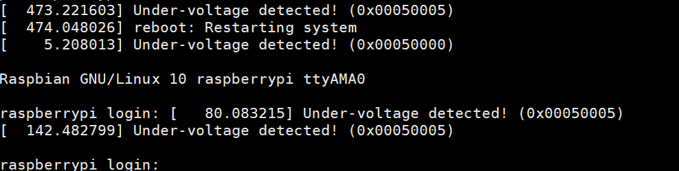

使能串口登陆：烧录系统的sd卡插入读卡器 插入电脑  修改boot 分区下面的config.txt  文件  最后一行增加 
dtoverlay=pi3-miniuart-bt
WiFi配置：
依然在boot位置 新建文件wpa_supplicant.conf  填充下面内容

    ctrl_interface=DIR=/var/run/wpa_supplicant GROUP=netdev
    update_config=1
    country=GB
    
    network={
            ssid="xxxxxx"
            psk="xxxxxxxxxx"
            key_mgmt=WPA-PSK
    }

重启就可以

新的系统很简洁  开机日志只有几行，没废话