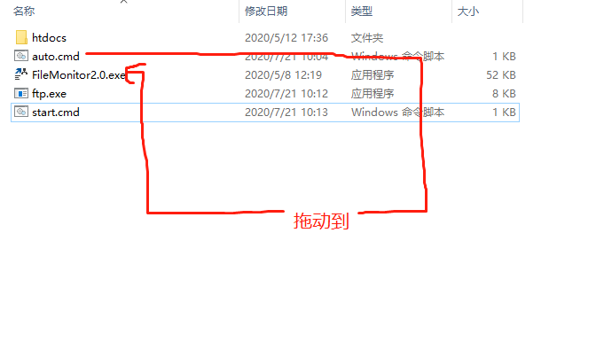
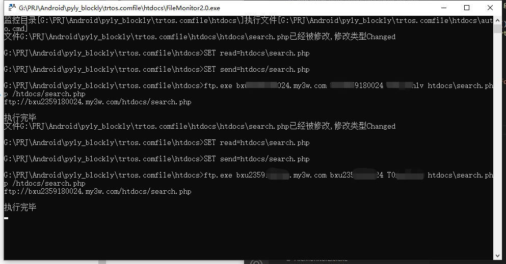
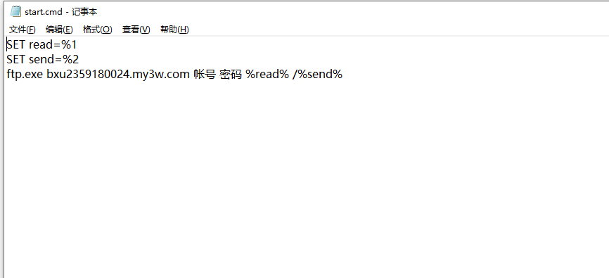

**[监测文件变动同步到ftp.zip][5]**

  [1]: http://typeecho.trtos.com/blog/typecho/%E5%BE%AE%E4%BF%A1%E6%88%AA%E5%9B%BE_20200720165358.png
  
  
  
  [5]: http://typeecho.trtos.com/blog/typecho/%E7%9B%91%E6%B5%8B%E6%96%87%E4%BB%B6%E5%8F%98%E5%8A%A8%E5%90%8C%E6%AD%A5%E5%88%B0ftp.zip