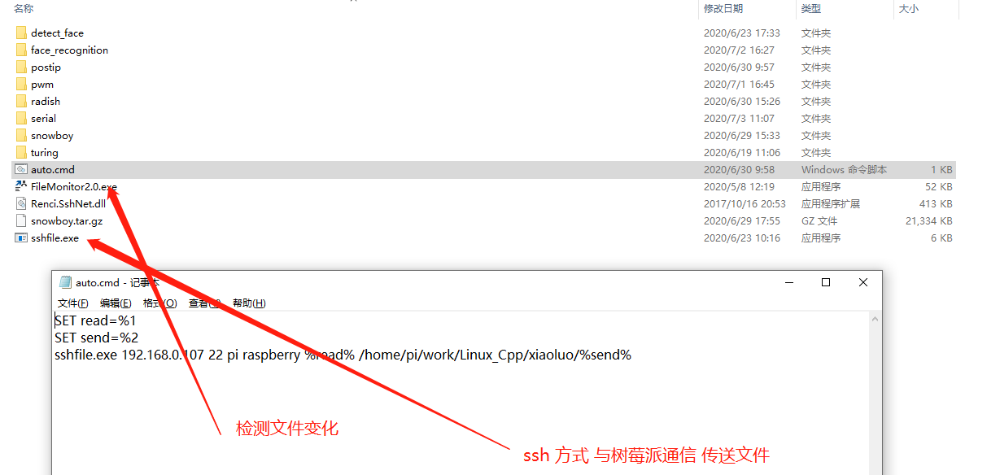
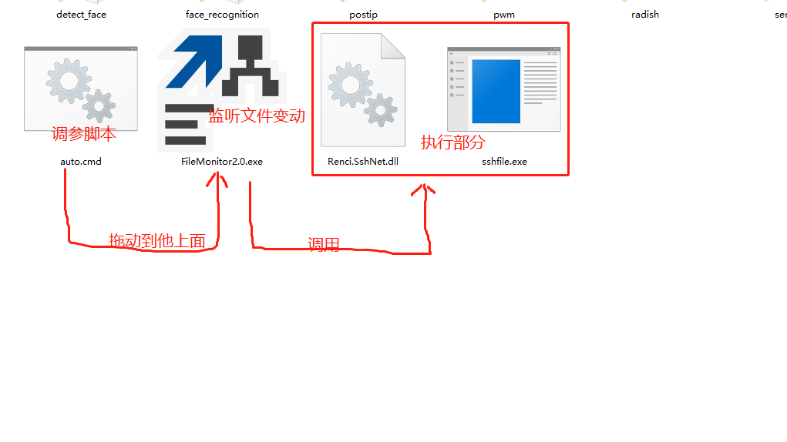

**使用场景**
通常 开发linux 应用 相信大家基本都使用win编辑 linux 编译运行的方式，针对 samba 或ftp 的不稳定 掉线了重连或安装的麻烦 故开发了这个简单的方式来同步文件加速开发，减少环境搭建工作量
使用时 ，只需要复制这四个文件到代码上级目录 拖动 auto.cmd 到 FileMonitor2.0.exe 即可，不要关掉，就可以开始撸码事宜。sshfile.exe 当然可以换成 ftp.exe 脚本 或 cp 脚本 post脚本 等等等等。。。。。只需要修改 auto.cmd  非常方便

auto.cmd这样写
    SET read=%1
    SET send=%2
    sshfile.exe 192.168.0.107 22 pi raspberry %read% /home/pi/work/Linux_Cpp/xiaoluo/%send%
参数1 和参数2 是匹配正反斜杠用，根据不同系统 修改脚本调用不同参数
**运行的逻辑**

**下载点击下面**

**[raspberry.zip][3]**
  
  
  [3]: http://typeecho.trtos.com/blog/typecho/raspberry.zip