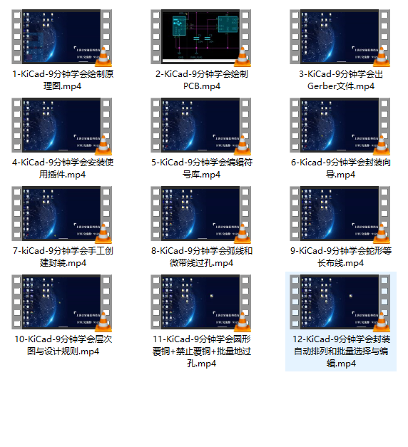

1-KiCad-9分钟学会绘制原理图.mp4
10-KiCad-9分钟学会层次图与设计规则.mp4
11-KiCad-9分钟学会圆形覆铜+禁止覆铜+批量地过孔.mp4
12-KiCad-9分钟学会封装自动排列和批量选择与编辑.mp4
2-KiCad-9分钟学会绘制PCB.mp4
3-KiCad-9分钟学会出Gerber文件.mp4
4-KiCad-9分钟学会安装使用插件.mp4
5-KiCad-9分钟学会编辑符号库.mp4
6-Kicad-9分钟学会封装向导.mp4
7-kiCad-9分钟学会手工创建封装.mp4
8-KiCad-9分钟学会弧线和微带线过孔.mp4
9-KiCad-9分钟学会蛇形等长布线.mp4

**节约网站空间，没上传，需要的微信或qq联系索取**

**节约网站空间，没上传，需要的微信或qq联系索取**