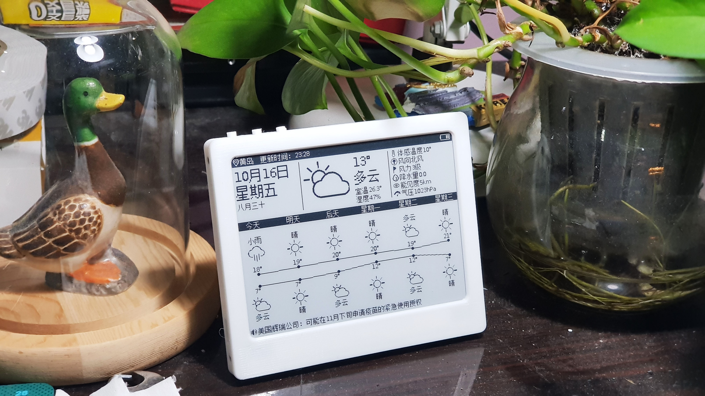
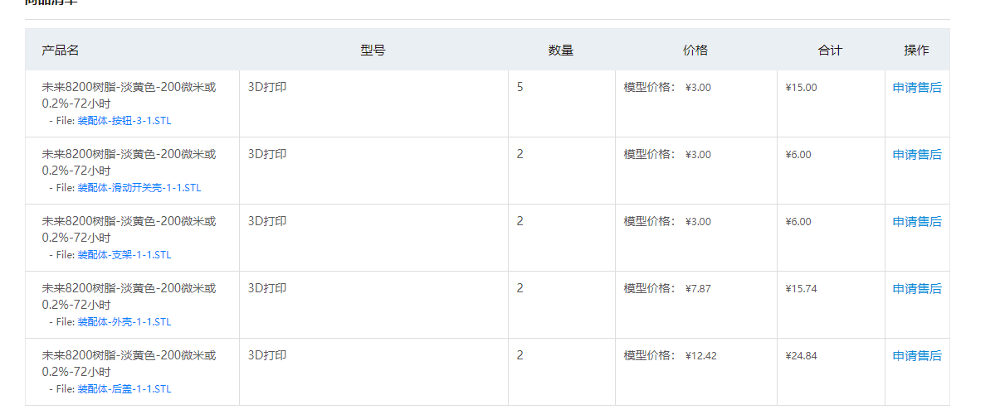

看到这里是不是有想自己做的冲动呢，没是不可能，资料给你搜集好了

pcb 开源的地址在这里 https://oshwhub.com/duck/4-2-cun-mo-shui-ping-ri-li
3d 打印的外壳 在这里  [4.2寸外壳2020-6-11.rar][3]
固件 在这里  [ver1.09.1添加WF42_SHT30.bin][4]
不说了，我去打印去了

  
  
  [3]: http://typeecho.trtos.com/blog/typecho/4.2%E5%AF%B8%E5%A4%96%E5%A3%B32020-6-11.rar
  [4]: http://typeecho.trtos.com/blog/typecho/ver1.09.1%E6%B7%BB%E5%8A%A0WF42_SHT30.bin