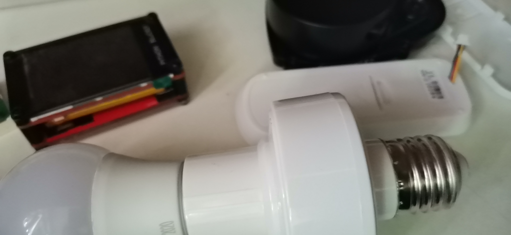
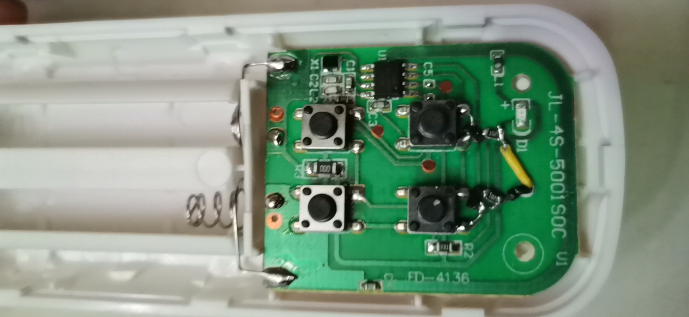
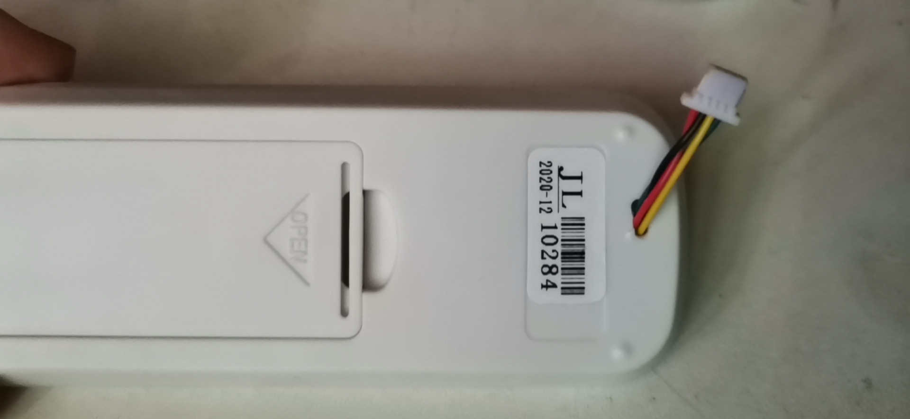

临时改一个无线控制灯的方案 买了这家的 灯  https://item.taobao.com/item.htm?spm=a1z09.2.0.0.56b02e8dZZ5qYi&id=618040741772&_u=ldclr3i4d66

打算用单片机io 去控制 按键 ，谁知道 按钮既不是 上拉又不是下拉 居然上不沾天下不沾地，空闲状态 1腿 3.3v 2 腿0 v 按下按键 1腿 2v 2 腿 1.2v  用镊子 短接 1腿到地或2腿到vcc 均不触发按钮事件，没办法io口直接驱动 只能加个三极管

改装测试
[dplayer url="http://typeecho.trtos.com/blog/typecho/ee2c1d56fa20c9733fbbc68c9d5b3a63.mp4" pic="" /]
