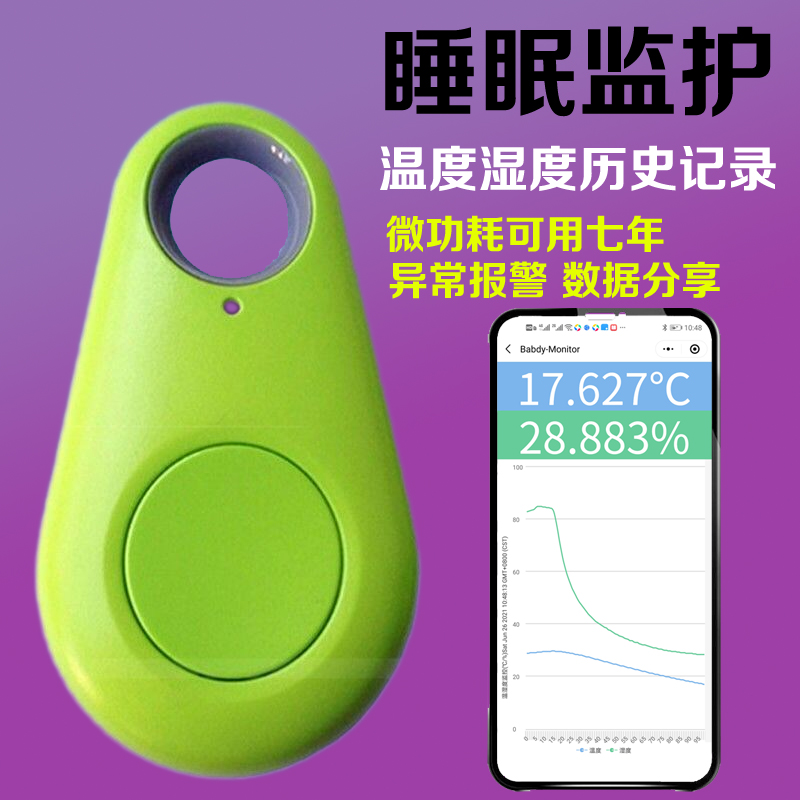
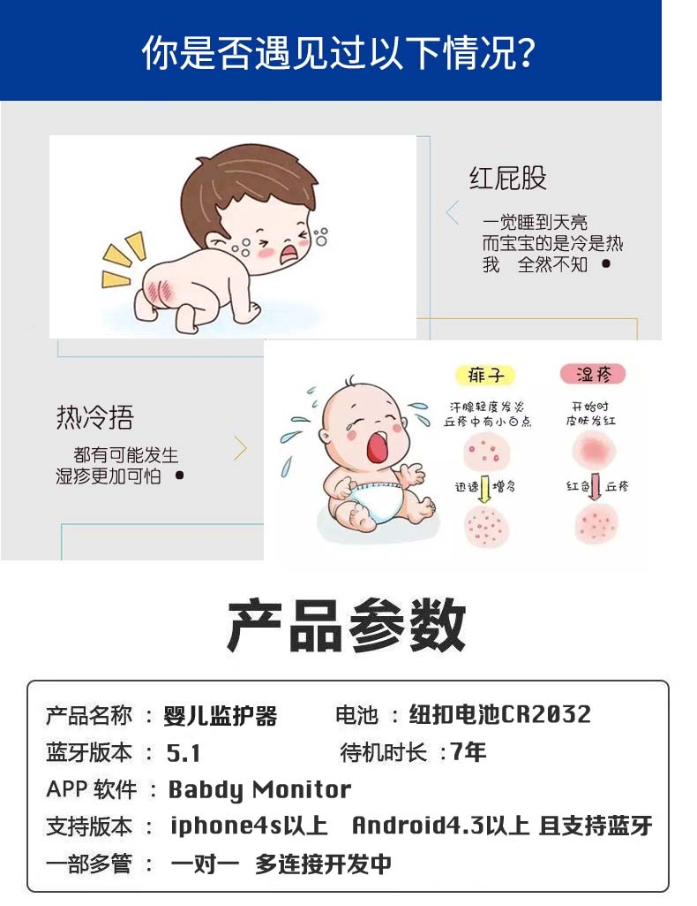
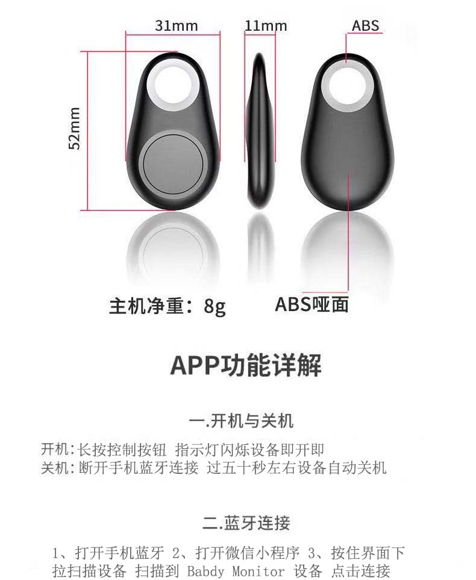
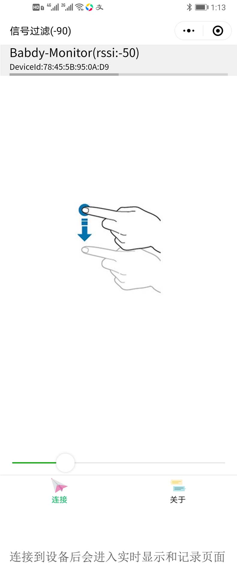
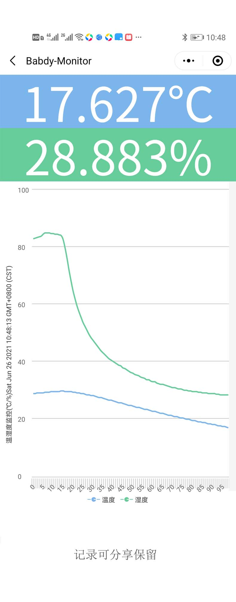
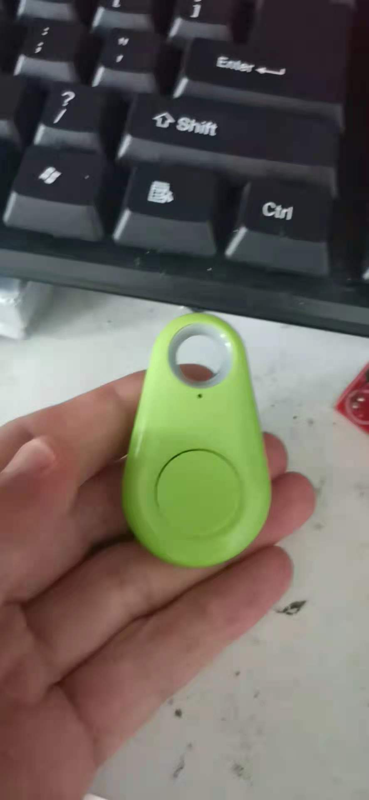
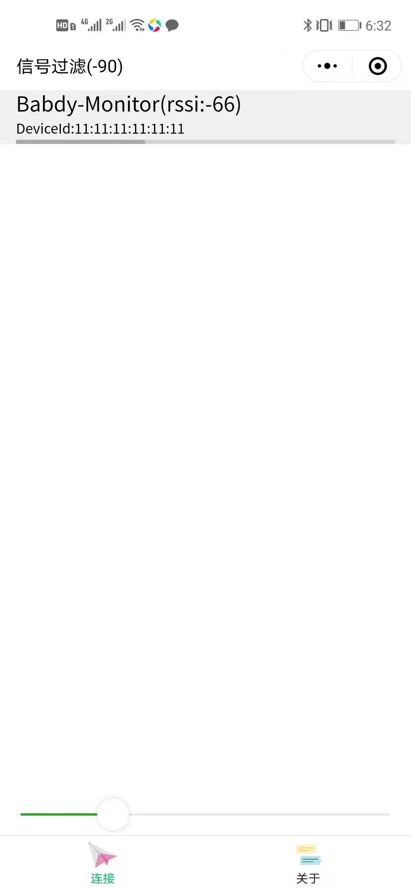

通过监测宝宝包被内温湿度来判断是否冷 热 捂  避免湿疹

[97b07c8617fffdcffdff23d4001f9dc5.mp4][9]
[89aadd2250fad9f183ff586d1655d201.mp4][10]
[dplayer url="http://typeecho.trtos.com/blog/typecho/97b07c8617fffdcffdff23d4001f9dc5.mp4" pic="" /]
[dplayer url="http://typeecho.trtos.com/blog/typecho/89aadd2250fad9f183ff586d1655d201.mp4" pic="" /]

  
  
  
  
  
  
  
  
  [9]: http://typeecho.trtos.com/blog/typecho/97b07c8617fffdcffdff23d4001f9dc5.mp4
  [10]: http://typeecho.trtos.com/blog/typecho/89aadd2250fad9f183ff586d1655d201.mp4