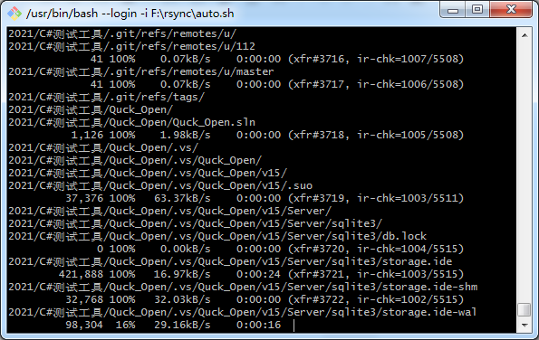
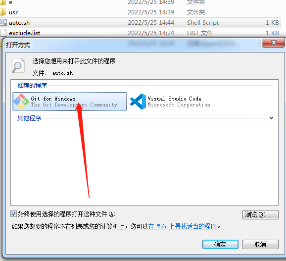

解压**[usr.zip][2]**到git 安装目录 D:\\\\Program Files\\\\Git\\\\usr
然后跟linux 下面一样 创建.sh文件 填入 命令rsync -rtv --exclude-from=exclude.list --progress  src  dst
双击就可以进行同步

  
  [2]: http://typeecho.trtos.com/blog/typecho/usr.zip