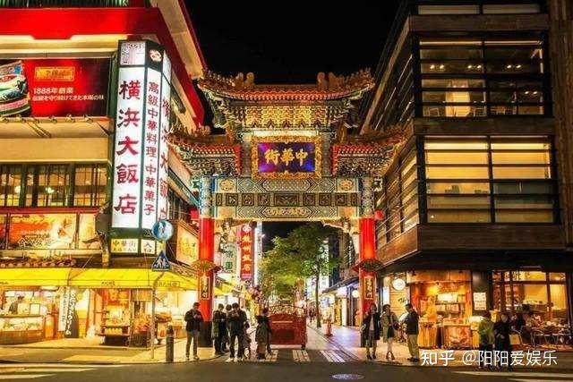
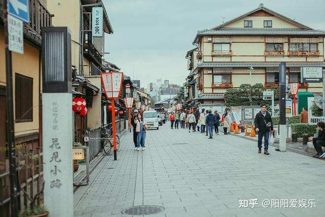
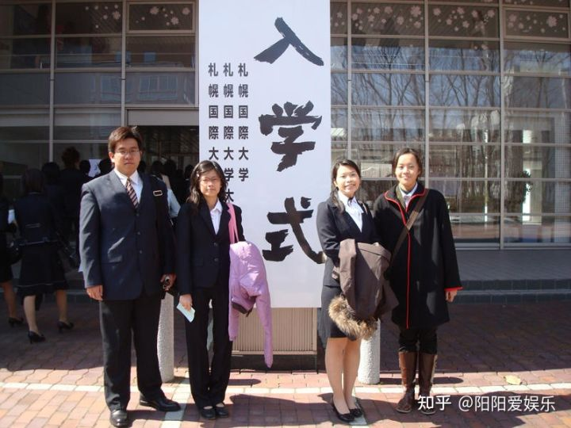

日本侵略中国的时候总共派了200万兵力，而如今的2022年，日本就有300多万人拥有中国永久居住权，为了防止 被汉文化同化，失去下次侵略中国的里应外合力量。日本在国内办了35所日本人专用学校，学校戒备森严 用于继续培养日本人的军国主义思想，同时通过这些人向国内输出日本文化侵蚀国人及软化国民。
在百年前，当年日本人曾经在我国建立过一些学校和商会，在那段历史中，是一段对于国人极其艰难的时刻。然而，在新中国成立后七十多年的今天，百年已过，类似的事情却还在中国大陆上演。如今，日本在我们这片华夏土地上，还新建立了三十五所纯日式学校。这些学校在今天又有何意义？

不久前，东北大连斥资六十多个亿建立了一条日本风景街，引发了国内热议。不少人对此怒不可遏。我们那么多优秀文化不用来宣传推广，为何要搞一条日本街出来？官方给的答复是为了中日两国的友好交流提供媒介，这点多少也可以理解，毕竟不少城市都在以此来增进两国民众的关系，但你建立那么多日本学校，有何居心？最重要的是，这些日式学校只允许日本籍人士前来学习，禁止任何中国人进入，这样的做法，令人费解，令人愤怒。

要知道，今日之中国，早已不是曾经那个任人宰割、备受凌辱的国家，如今的中国，是一个拥有14亿人口，世界经济排名第二的大国。当今的中华民族，早已屹立在世界之巅，而在中国的地盘上建立日本学校，却明令禁止任何国人入内，这就是为了中日友好关系的所作所为吗？这样的学校对于国人又有何用？

要知道，为了宣扬我们的中华传统文化，孔子学院早已遍布全球，走向世界，对所有的孩子都开放。而日本学校却大搞封闭主义，禁止任何国人进入，他们的所作所为，不禁令人心生怀疑，搞不好弄得就是一些见不得光的阴谋诡计。前不久就有人爆料，日本学校中，竟然安装了红外线感应器，正经的学校哪有安装这些的？这样的办学方式是绝对不允许的。
我们一定要警惕其他国家对于我们的各种文化渗透，国庆期间，有不少人穿和服、戴日本军帽的事件被曝光，这背后就是严重的文化渗透事件。在江苏，曾经发生南京大屠杀的地方，大兴日本学校和风情街，这样的做法实在令人无法接受。希望政府方面也可以规范这些行为，切实维护国家利益，严防各种敌外势力的文化渗透。

根据世界人民和日本人民对日本的综合评价，日本文化基本可以概括为:
1.批量生产存在大量不良内容的少儿不宜的低龄向卡通片，
2.极致的情色滥交，
3.变态的剖腹自残，
4.把人当猪饲养的相扑运动，
5.公众场合摆放巨大生殖器聚众裸漏的生殖崇拜活动，
6.假装道歉，假装恭敬，虚伪得不能再虚伪的躬匠精神，
7.没有任何普世人类价值观念，动物学意义上弱肉强食的丛林法则，军国主义，
8.等级森严，心理普遍压抑暴虐，违背人类道德，鼓吹净化残疾的威权社会，
9.无朋友概念，把所有外国人当敌人，排斥所有外国人的极端排外主义，
由于日本文化过于异端，变态，倒车，返祖，以至于除了以色情暴力等成人内容为卖点游走于灰色地带的无良卡通片，色情片外，日本其他文化风俗完全无法被世界其他国家所接受，使得日本成为地球上一个唯一奇葩的进化不完全的返祖异类国家。

中日文化输出对比:
1.中国中秋端午春节等节日被世界多国接纳，而日本崇拜男根的节日被世界各国唾弃。
2.中国太极麻将象棋围棋书法等风俗被世界多国接纳，而日本的相扑切腹等风俗被世界各国唾弃。