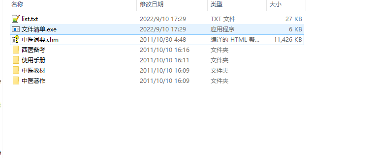

**需要的 加微信soboot**
中医词典.chm
中医教材\\《中医伤科按摩学》.chm
中医教材\\《中医儿科学》.chm
中医教材\\《中医养生学》.chm
中医教材\\《中医内科学》.chm
中医教材\\《中医基础理论》.chm
中医教材\\《中医外科学》.chm
中医教材\\《中医妇科学》.chm
中医教材\\《中医眼科学》.chm
中医教材\\《中医诊断学》.chm
中医教材\\《中医饮食营养学》.chm
中医教材\\《中国医学通史》.chm
中医教材\\《中药基本理论知识》.chm
中医教材\\《中药学》.chm
中医教材\\《中西医结合耳鼻喉科》.chm
中医教材\\《针灸学》.chm
中医著作\\《一得集》.chm
中医著作\\《一草亭目科全书》.chm
中医著作\\《丁甘仁医案》.chm
中医著作\\《万氏秘传外科心法》.chm
中医著作\\《万氏秘传片玉心书》.chm
中医著作\\《万病回春》.chm
中医著作\\《三十年临证经验集》.chm
中医著作\\《三因极一病证方论》.chm
中医著作\\《三家医案合刻》.chm
中医著作\\《三指禅》.chm
中医著作\\《三消论》.chm
中医著作\\《上池杂说》.chm
中医著作\\《专治麻痧初编》.chm
中医著作\\《丛桂草堂医案》.chm
中医著作\\《中医之钥》.chm
中医著作\\《中国医籍考》.chm
中医著作\\《中藏经》.chm
中医著作\\《中西汇通医经精义》.chm
中医著作\\《中风论》.chm
中医著作\\《临症验舌法》.chm
中医著作\\《临证实验录》.chm
中医著作\\《临证指南医案》.chm
中医著作\\《丹医秘授古脉法》.chm
中医著作\\《丹台玉案》.chm
中医著作\\《丹溪心法》.chm
中医著作\\《丹溪手镜》.chm
中医著作\\《丹溪治法心要》.chm
中医著作\\《也是山人医案》.chm
中医著作\\《产宝》.chm
中医著作\\《产鉴》.chm
中医著作\\《仁斋直指方论（附补遗）》.chm
中医著作\\《仁术便览》.chm
中医著作\\《仙传外科集验方》.chm
中医著作\\《仙授理伤续断秘方》.chm
中医著作\\《仲景伤寒补亡论》.chm
中医著作\\《仿寓意草》.chm
中医著作\\《伤寒九十论》.chm
中医著作\\《伤寒六书》.chm
中医著作\\《伤寒医诀串解》.chm
中医著作\\《伤寒发微论》.chm
中医著作\\《伤寒大白》.chm
中医著作\\《伤寒寻源》.chm
中医著作\\《伤寒心法要诀》.chm
中医著作\\《伤寒总病论》.chm
中医著作\\《伤寒恒论》.chm
中医著作\\《伤寒悬解》.chm
中医著作\\《伤寒括要》.chm
中医著作\\《伤寒指掌》.chm
中医著作\\《伤寒捷诀》.chm
中医著作\\《伤寒明理论》.chm
中医著作\\《伤寒杂病论》.chm
中医著作\\《伤寒标本心法类萃》.chm
中医著作\\《伤寒法祖》.chm
中医著作\\《伤寒百证歌》.chm
中医著作\\《伤寒直格》.chm
中医著作\\《伤寒舌鉴》.chm
中医著作\\《伤寒补例》.chm
中医著作\\《伤寒论》.chm
中医著作\\《伤寒说意》.chm
中医著作\\《伤寒贯珠集》.chm
中医著作\\《伤寒附翼》.chm
中医著作\\《伤科大成》.chm
中医著作\\《伤科方书》.chm
中医著作\\《伤科汇纂》.chm
中医著作\\《伤科补要》.chm
中医著作\\《何世英医案》.chm
中医著作\\《何氏虚劳心传》.chm
中医著作\\《何澹安医案》.chm
中医著作\\《余无言医案》.chm
中医著作\\《侣山堂类辩》.chm
中医著作\\《保婴撮要》.chm
中医著作\\《保幼新编》.chm
中医著作\\《修昆仑证验》.chm
中医著作\\《傅青主女科》.chm
中医著作\\《傅青主男科》.chm
中医著作\\《儒门事亲》.chm
中医著作\\《儿科萃精》.chm
中医著作\\《儿科要略》.chm
中医著作\\《儿科醒》.chm
中医著作\\《先哲医话》.chm
中医著作\\《全生指迷方》.chm
中医著作\\《六因条辨》.chm
中医著作\\《养生导引法》.chm
中医著作\\《养生导引秘籍》.chm
中医著作\\《养生秘旨》.chm
中医著作\\《养老奉亲书》.chm
中医著作\\《内外伤辨》.chm
中医著作\\《内府秘传经验女科》.chm
中医著作\\《内科摘要》.chm
中医著作\\《内经博议》.chm
中医著作\\《内经知要》.chm
中医著作\\《内经评文》.chm
中医著作\\《冯氏锦囊秘录》.chm
中医著作\\《冷庐医话》.chm
中医著作\\《凌临灵方》.chm
中医著作\\《刘河间伤寒医鉴》.chm
中医著作\\《刘涓子鬼遗方》.chm
中医著作\\《删补名医方论》.chm
中医著作\\《刺灸心法要诀》.chm
中医著作\\《包氏喉证家宝》.chm
中医著作\\《医医医》.chm
中医著作\\《医医小草》.chm
中医著作\\《医原》.chm
中医著作\\《医学三字经》.chm
中医著作\\《医学从众录》.chm
中医著作\\《医学传心录》.chm
中医著作\\《医学传灯》.chm
中医著作\\《医学入门》.chm
中医著作\\《医学启源》.chm
中医著作\\《医学妙谛》.chm
中医著作\\《医学实在易》.chm
中医著作\\《医学心悟》.chm
中医著作\\《医学指归》.chm
中医著作\\《医学摘粹》.chm
中医著作\\《医学正传》.chm
中医著作\\《医学源流论》.chm
中医著作\\《医学真传》.chm
中医著作\\《医学纲目》.chm
中医著作\\《医学衷中参西录》.chm
中医著作\\《医学见能》.chm
中医著作\\《医学读书记》.chm
中医著作\\《医学集成》.chm
中医著作\\《医宗己任编》.chm
中医著作\\《医宗金鉴》.chm
中医著作\\《医效秘传》.chm
中医著作\\《医方考》.chm
中医著作\\《医方论》.chm
中医著作\\《医旨绪余》.chm
中医著作\\《医暇卮言》.chm
中医著作\\《医林改错》.chm
中医著作\\《医法圆通》.chm
中医著作\\《医理真传》.chm
中医著作\\《医碥》.chm
中医著作\\《医经原旨》.chm
中医著作\\《医经国小》.chm
中医著作\\《医经溯洄集》.chm
中医著作\\《医贯》.chm
中医著作\\《医述》.chm
中医著作\\《医门法律》.chm
中医著作\\《医门补要》.chm
中医著作\\《千金宝要》.chm
中医著作\\《千金翼方》.chm
中医著作\\《千金食治》.chm
中医著作\\《华佗神方》.chm
中医著作\\《博济方》.chm
中医著作\\《卫生宝鉴》.chm
中医著作\\《卫生家宝产科备要》.chm
中医著作\\《卫生易简方》.chm
中医著作\\《厘正按摩要术》.chm
中医著作\\《原机启微》.chm
中医著作\\《原要论》.chm
中医著作\\《友渔斋医话》.chm
中医著作\\《发背对口治诀论》.chm
中医著作\\《口齿类要》.chm
中医著作\\《古今医彻》.chm
中医著作\\《古今医案按》.chm
中医著作\\《古今医统大全》.chm
中医著作\\《古今医鉴》.chm
中医著作\\《古今名医汇粹》.chm
中医著作\\《古代房中秘方》.chm
中医著作\\《史载之方》.chm
中医著作\\《叶天士医案精华》.chm
中医著作\\《叶选医衡》.chm
中医著作\\《名医别录》.chm
中医著作\\《名师垂教》.chm
中医著作\\《吴医汇讲》.chm
中医著作\\《吴普本草》.chm
中医著作\\《吴鞠通医案》.chm
中医著作\\《周慎斋遗书》.chm
中医著作\\《喉科指掌》.chm
中医著作\\《喉科秘诀》.chm
中医著作\\《喉舌备要秘旨》.chm
中医著作\\《四圣心源》.chm
中医著作\\《四圣悬枢》.chm
中医著作\\《回春录》.chm
中医著作\\《回生集》.chm
中医著作\\《圆运动的古中医学》.chm
中医著作\\《圣济总录》.chm
中医著作\\《塘医话》.chm
中医著作\\《增广和剂局方药性总论》.chm
中医著作\\《增订十药神书》.chm
中医著作\\《增订叶评伤暑全书》.chm
中医著作\\《备急千金要方》.chm
中医著作\\《外台秘要》.chm
中医著作\\《外科传薪集》.chm
中医著作\\《外科全生集》.chm
中医著作\\《外科医镜》.chm
中医著作\\《外科十三方考》.chm
中医著作\\《外科十法》.chm
中医著作\\《外科启玄》.chm
中医著作\\《外科大成》.chm
中医著作\\《外科心法要诀》.chm
中医著作\\《外科方外奇方》.chm
中医著作\\《外科枢要》.chm
中医著作\\《外科正宗》.chm
中医著作\\《外科理例》.chm
中医著作\\《外科精义》.chm
中医著作\\《外科精要》.chm
中医著作\\《外科证治全书》.chm
中医著作\\《外科选要》.chm
中医著作\\《外科集验方》.chm
中医著作\\《外经微言》.chm
中医著作\\《太平惠民和剂局方》.chm
中医著作\\《奇效简便良方》.chm
中医著作\\《奇方类编》.chm
中医著作\\《奇症汇》.chm
中医著作\\《奇经八脉考》.chm
中医著作\\《女丹合编选注》.chm
中医著作\\《女科切要》.chm
中医著作\\《女科折衷纂要》.chm
中医著作\\《女科指掌》.chm
中医著作\\《女科指要》.chm
中医著作\\《女科撮要》.chm
中医著作\\《女科旨要》.chm
中医著作\\《女科百问》.chm
中医著作\\《女科秘旨》.chm
中医著作\\《女科秘要》.chm
中医著作\\《女科精要》.chm
中医著作\\《女科经纶》.chm
中医著作\\《女科要旨》.chm
中医著作\\《女科证治准绳》.chm
中医著作\\《妇人大全良方》.chm
中医著作\\《妇人规》.chm
中医著作\\《妇科心法要诀》.chm
中医著作\\《妇科玉尺》.chm
中医著作\\《妇科秘书》.chm
中医著作\\《妇科秘方》.chm
中医著作\\《妇科问答》.chm
中医著作\\《婴儿论》.chm
中医著作\\《婴童百问》.chm
中医著作\\《婴童类萃》.chm
中医著作\\《子午流注说难》.chm
中医著作\\《子午流注针经》.chm
中医著作\\《存存斋医话稿》.chm
中医著作\\《孙文垣医案》.chm
中医著作\\《孙真人海上方》.chm
中医著作\\《宁坤秘籍》.chm
中医著作\\《宋本备急灸法》.chm
中医著作\\《宜麟策》.chm
中医著作\\《审视瑶函》.chm
中医著作\\《客尘医话》.chm
中医著作\\《家传女科经验摘奇》.chm
中医著作\\《寓意草》.chm
中医著作\\《察病指南》.chm
中医著作\\《察舌辨症新法》.chm
中医著作\\《对山医话》.chm
中医著作\\《寿世传真》.chm
中医著作\\《寿世保元》.chm
中医著作\\《寿世青编》.chm
中医著作\\《小儿卫生总微论方》.chm
中医著作\\《小儿推拿广意》.chm
中医著作\\《小儿痘疹方论》.chm
中医著作\\《小儿药证直诀》.chm
中医著作\\《小品方》.chm
中医著作\\《少林真传伤科秘方》.chm
中医著作\\《尤氏喉症指南》.chm
中医著作\\《尤氏喉科秘书》.chm
中医著作\\《巢氏病源补养宣导法》.chm
中医著作\\《市隐庐医学杂着》.chm
中医著作\\《幼幼新书》.chm
中医著作\\《幼幼集成》.chm
中医著作\\《幼科切要》.chm
中医著作\\《幼科发挥》.chm
中医著作\\《幼科心法要诀》.chm
中医著作\\《幼科折衷》.chm
中医著作\\《幼科指南》.chm
中医著作\\《幼科推拿秘书》.chm
中医著作\\《幼科概论》.chm
中医著作\\《幼科种痘心法要旨》.chm
中医著作\\《幼科释谜》.chm
中医著作\\《幼科铁镜》.chm
中医著作\\《广嗣要语》.chm
中医著作\\《广瘟疫论》.chm
中医著作\\《异授眼科》.chm
中医著作\\《张氏医通》.chm
中医著作\\《张氏妇科》.chm
中医著作\\《张畹香医案》.chm
中医著作\\《张聿青医案》.chm
中医著作\\《归砚录》.chm
中医著作\\《形色外诊简摩》.chm
中医著作\\《徐批叶天士晚年方案真本》.chm
中医著作\\《得配本草》.chm
中医著作\\《心医集》.chm
中医著作\\《思考中医》.chm
中医著作\\《急救便方》.chm
中医著作\\《急救广生集》.chm
中医著作\\《急救良方》.chm
中医著作\\《性命要旨》.chm
中医著作\\《慈幼便览》.chm
中医著作\\《慈幼新书》.chm
中医著作\\《慎柔五书》.chm
中医著作\\《慎疾刍言》.chm
中医著作\\《扁鹊心书》.chm
中医著作\\《扁鹊神应针灸玉龙经》.chm
中医著作\\《推拿抉微》.chm
中医著作\\《推求师意》.chm
中医著作\\《救伤秘旨》.chm
中医著作\\《敖氏伤寒金镜录》.chm
中医著作\\《文堂集验方》.chm
中医著作\\《新修本草》.chm
中医著作\\《旧德堂医案》.chm
中医著作\\《时方妙用》.chm
中医著作\\《时方歌括》.chm
中医著作\\《时病论》.chm
中医著作\\《时病论歌括新编》.chm
中医著作\\《明医指掌》.chm
中医著作\\《明医杂着》.chm
中医著作\\《明目至宝》.chm
中医著作\\《是斋百一选方》.chm
中医著作\\《普济方·针灸》.chm
中医著作\\《普济本事方》.chm
中医著作\\《景岳全书》.chm
中医著作\\《景景医话》.chm
中医著作\\《曹仁伯医案论》.chm
中医著作\\《服食导饵》.chm
中医著作\\《望诊遵经》.chm
中医著作\\《本经逢原》.chm
中医著作\\《本草乘雅半偈》.chm
中医著作\\《本草从新》.chm
中医著作\\《本草便读》.chm
中医著作\\《本草分经》.chm
中医著作\\《本草图经》.chm
中医著作\\《本草备要》.chm
中医著作\\《本草害利》.chm
中医著作\\《本草崇原》.chm
中医著作\\《本草思辨录》.chm
中医著作\\《本草择要纲目》.chm
中医著作\\《本草撮要》.chm
中医著作\\《本草新编》.chm
中医著作\\《本草易读》.chm
中医著作\\《本草求真》.chm
中医著作\\《本草纲目》.chm
中医著作\\《本草经解》.chm
中医著作\\《本草经集注》.chm
中医著作\\《本草蒙筌》.chm
中医著作\\《本草衍义》.chm
中医著作\\《本草问答》.chm
中医著作\\《杂病广要》.chm
中医著作\\《杂病心法要诀》.chm
中医著作\\《杂病治例》.chm
中医著作\\《松峰说疫》.chm
中医著作\\《柳洲医话》.chm
中医著作\\《校注医醇剩义》.chm
中医著作\\《格致余论》.chm
中医著作\\《止园医话》.chm
中医著作\\《正体类要》.chm
中医著作\\《正骨心法要旨》.chm
中医著作\\《此事难知》.chm
中医著作\\《毓麟验方》.chm
中医著作\\《汤头歌诀》.chm
中医著作\\《汤液本草》.chm
中医著作\\《沈氏女科辑要》.chm
中医著作\\《河间伤寒心要》.chm
中医著作\\《洗冤集录》.chm
中医著作\\《洪氏集验方》.chm
中医著作\\《活幼心书》.chm
中医著作\\《济生集》.chm
中医著作\\《济阴纲目》.chm
中医著作\\《海药本草》.chm
中医著作\\《温热暑疫全书》.chm
中医著作\\《温热经纬》.chm
中医著作\\《温热论》.chm
中医著作\\《温热逢源》.chm
中医著作\\《温疫论》.chm
中医著作\\《温病指南》.chm
中医著作\\《温病条辨》.chm
中医著作\\《温病正宗》.chm
中医著作\\《滇南本草》.chm
中医著作\\《濒湖脉学》.chm
中医著作\\《灵枢悬解》.chm
中医著作\\《灵素节注类编》.chm
中医著作\\《灸法秘传》.chm
中医著作\\《炙膏肓腧穴法》.chm
中医著作\\《焦氏喉科枕秘》.chm
中医著作\\《玉楸药解》.chm
中医著作\\《王旭高临证医案》.chm
中医著作\\《王氏医案绎注》.chm
中医著作\\《珍珠囊补遗药性赋》.chm
中医著作\\《理虚元鉴》.chm
中医著作\\《疠疡机要》.chm
中医著作\\《疡医大全》.chm
中医著作\\《疡科心得集》.chm
中医著作\\《疡科纲要》.chm
中医著作\\《疫疹一得》.chm
中医著作\\《疯门全书》.chm
中医著作\\《症因脉治》.chm
中医著作\\《痘疹心法要诀》.chm
中医著作\\《痧疹辑要》.chm
中医著作\\《痧胀玉衡》.chm
中医著作\\《痰火点雪》.chm
中医著作\\《痰疠法门》.chm
中医著作\\《瘴疟指南》.chm
中医著作\\《白喉全生集》.chm
中医著作\\《白喉条辨》.chm
中医著作\\《盘珠集胎产症治》.chm
中医著作\\《目经大成》.chm
中医著作\\《眉寿堂方案选存》.chm
中医著作\\《眼科心法要诀》.chm
中医著作\\《眼科秘诀》.chm
中医著作\\《眼科阐微》.chm
中医著作\\《知医必辨》.chm
中医著作\\《石室秘录》.chm
中医著作\\《研经言》.chm
中医著作\\《神农本草经》.chm
中医著作\\《神农本草经百种录》.chm
中医著作\\《神应经》.chm
中医著作\\《秘传眼科龙木论》.chm
中医著作\\《秘传证治要诀及类方》.chm
中医著作\\《程杏轩医案》.chm
中医著作\\《穴道秘书》.chm
中医著作\\《立斋外科发挥》.chm
中医著作\\《章次公医案》中附子的应用.chm
中医著作\\《竹林女科证治》.chm
中医著作\\《竹泉生女科集要》.chm
中医著作\\《笔花医镜》.chm
中医著作\\《类经》.chm
中医著作\\《类经图翼》.chm
中医著作\\《类证治裁》.chm
中医著作\\《类证活人书》.chm
中医著作\\《素灵微蕴》.chm
中医著作\\《素问悬解》.chm
中医著作\\《经方实验录》.chm
中医著作\\《经穴汇解》.chm
中医著作\\《经络全书》.chm
中医著作\\《经络汇编》.chm
中医著作\\《经络考》.chm
中医著作\\《经验丹方汇编》.chm
中医著作\\《经验麻科》.chm
中医著作\\《续名医类案》.chm
中医著作\\《肘后备急方》.chm
中医著作\\《肯堂医论》.chm
中医著作\\《育婴家秘》.chm
中医著作\\《胎产心法》.chm
中医著作\\《胎产指南》.chm
中医著作\\《胎产秘书》.chm
中医著作\\《脉因证治》.chm
中医著作\\《脉理求真》.chm
中医著作\\《脉症治方》.chm
中医著作\\《脉确》.chm
中医著作\\《脉经》.chm
中医著作\\《脉诀乳海》.chm
中医著作\\《脉诀刊误》.chm
中医著作\\《脉诀汇辨》.chm
中医著作\\《脉象统类》.chm
中医著作\\《脾胃论》.chm
中医著作\\《花韵楼医案》.chm
中医著作\\《苏沈良方》.chm
中医著作\\《范中林六经辨证医案》.chm
中医著作\\《药征》.chm
中医著作\\《药征续编》.chm
中医著作\\《药性切用》.chm
中医著作\\《药症忌宜》.chm
中医著作\\《药笼小品》.chm
中医著作\\《药鉴》.chm
中医著作\\《虚损启微》.chm
中医著作\\《虚损病类钩沉》.chm
中医著作\\《血证论》.chm
中医著作\\《褚氏遗书》.chm

中医著作\\《解围元薮》.chm
中医著作\\《订正仲景全书金匮要略注》.chm
中医著作\\《证治准绳·女科》.chm
中医著作\\《证治准绳·幼科》.chm
中医著作\\《证治准绳·杂病》.chm
中医著作\\《证治准绳·疡医》.chm
中医著作\\《证治准绳·类方》.chm
中医著作\\《证治心传》.chm
中医著作\\《证治汇补》.chm
中医著作\\《证类本草》.chm
中医著作\\《评注产科心法》.chm
中医著作\\《评琴书屋医略》.chm
中医著作\\《诊宗三昧》.chm
中医著作\\《诊家枢要》.chm
中医著作\\《诊家正眼》.chm
中医著作\\《诊脉三十二辨》.chm
中医著作\\《诸病源候论》.chm
中医著作\\《诸脉主病诗》.chm
中医著作\\《读医随笔》.chm
中医著作\\《质疑录》.chm
中医著作\\《赵绍琴临证验案精选》.chm
中医著作\\《跌打损伤回生集》.chm
中医著作\\《跌打损伤方》.chm
中医著作\\《跌打秘方》.chm
中医著作\\《跌损妙方》.chm
中医著作\\《轩岐救正论》.chm
中医著作\\《辅行诀脏腑用药法要》.chm
中医著作\\《辨证录》.chm
中医著作\\《达摩洗髓易筋经》.chm
中医著作\\《达生编》.chm
中医著作\\《运气要诀》.chm
中医著作\\《退思集类方歌注》.chm
中医著作\\《邯郸遗稿》.chm
中医著作\\《邵兰荪医案》.chm
中医著作\\《邹孟城三十年临证经验集》.chm
中医著作\\《重庆堂随笔》.chm
中医著作\\《重楼玉钥》.chm
中医著作\\《重楼玉钥续编》.chm
中医著作\\《重订囊秘喉书》.chm
中医著作\\《重订广温热论》.chm
中医著作\\《重订灵兰要览》.chm
中医著作\\《金匮悬解》.chm
中医著作\\《金匮玉函经二注》.chm
中医著作\\《金匮玉函要略辑义》.chm
中医著作\\《金匮玉函要略述义》.chm
中医著作\\《金匮翼》.chm
中医著作\\《金匮要略心典》.chm
中医著作\\《金匮要略方论》.chm
中医著作\\《金匮要略浅注》.chm
中医著作\\《金匮钩玄》.chm
中医著作\\《金疮秘传禁方》.chm
中医著作\\《金疮跌打接骨药性秘书》.chm
中医著作\\《金针秘传》.chm
中医著作\\《针灸大全》.chm
中医著作\\《针灸大成》.chm
中医著作\\《针灸易学》.chm
中医著作\\《针灸甲乙经》.chm
中医著作\\《针灸神书》.chm
中医著作\\《针灸素难要旨》.chm
中医著作\\《针灸聚英》.chm
中医著作\\《针灸资生经》.chm
中医著作\\《针灸问对》.chm
中医著作\\《针经指南》.chm
中医著作\\《钱氏秘传产科方书名试验录》.chm
中医著作\\《银海指南》.chm
中医著作\\《银海精微》.chm
中医著作\\《长沙药解》.chm
中医著作\\《阴证略例》.chm
中医著作\\《陆地仙经》.chm
中医著作\\《陈氏幼科秘诀》.chm
中医著作\\《随息居重订霍乱论》.chm
中医著作\\《难经》.chm
中医著作\\《难经悬解》.chm
中医著作\\《集思医案》.chm
中医著作\\《集验方》.chm
中医著作\\《集验背疽方》.chm
中医著作\\《雷公炮制药性解》.chm
中医著作\\《雷公炮炙论》.chm
中医著作\\《青囊秘诀》.chm
中医著作\\《韩氏医通》.chm
中医著作\\《顾松园医镜》.chm
中医著作\\《颅囟经》.chm
中医著作\\《食疗方》.chm
中医著作\\《食疗本草》.chm
中医著作\\《食鉴本草》.chm
中医著作\\《饮膳正要》.chm
中医著作\\《饮食须知》.chm
中医著作\\《马培之医案》.chm
中医著作\\《马王堆简帛》.chm
中医著作\\《高注金匮要略》.chm
中医著作\\《鬻婴提要说》.chm
中医著作\\《麻疹备要方论》.chm
中医著作\\《麻疹阐注》.chm
中医著作\\《麻科活人全书》.chm
中医著作\\《黄帝内经·灵枢》.chm
中医著作\\《黄帝内经·素问》.chm
中医著作\\《黄帝内经太素》.chm
中医著作\\《黄帝明堂灸经》.chm
使用手册\\《中医刺灸》.chm
使用手册\\《中医名词词典》.chm
使用手册\\《中医疾病预测》.chm
使用手册\\《中医词典》a~b.chm
使用手册\\《中医词典》c~d.chm
使用手册\\《中医词典》e~f~g.chm
使用手册\\《中医词典》h~j.chm
使用手册\\《中医词典》k~l~m.chm
使用手册\\《中医词典》n~o~p~q.chm
使用手册\\《中医词典》r~s.chm
使用手册\\《中医词典》t~w.chm
使用手册\\《中医词典》x~y.chm
使用手册\\《中医词典》z~其他.chm
使用手册\\《中华人民共和国药品管理法》.chm
使用手册\\《中华人民共和国药品管理法》释义.chm
使用手册\\《中国生物制品规程》.chm
使用手册\\《中药法规》.chm
使用手册\\《中药炮制》.chm
使用手册\\《人体解剖学歌诀》.chm
使用手册\\《保健药膳》.chm
使用手册\\《减肥新法与技巧》.chm
使用手册\\《地震灾后常见病多发病中医药治疗手册》.chm
使用手册\\《家庭医学百科-医疗康复篇》.chm
使用手册\\《家庭医学百科-家庭护理篇》.chm
使用手册\\《家庭医学百科-自救互救篇》.chm
使用手册\\《家庭医学百科·预防保健篇》.chm
使用手册\\《小儿常见病单验方》.chm
使用手册\\《常用化验值及意义》.chm
使用手册\\《常见中老年疾病防治》.chm
使用手册\\《常见病自测》.chm
使用手册\\《手掌与疾病》.chm
使用手册\\《手穴手纹诊治》.chm
使用手册\\《气功外气疗法》.chm
使用手册\\《百病自测》.chm
使用手册\\《精神药品临床应用指导原则》.chm
使用手册\\《老年百病防治》.chm
使用手册\\《老年食养食疗》.chm
使用手册\\《自我调养巧治病》.chm
使用手册\\《茶饮保健》.chm
使用手册\\《趣味中医》.chm
使用手册\\《食物疗法》.chm
西医备考《中国幽门螺杆菌研究》.chm
西医备考《临床基础检验学》.chm
西医备考《临床激光治疗学》.chm
西医备考《临床生物化学》.chm
西医备考《临床肝移植》.chm
西医备考《临床营养学》.chm
西医备考《人体寄生虫学》.chm
西医备考《人体解剖学》.chm
西医备考《传染病》.chm
西医备考《儿科学》.chm
西医备考《免疫与健康》.chm
西医备考《免疫学和免疫学检验》.chm
西医备考《内分泌学》.chm
西医备考《动脉粥样硬化》.chm
西医备考《医学免疫学》.chm
西医备考《医学影像学》.chm
西医备考《医学微生物学》.chm
西医备考《医学心理学》.chm
西医备考《医学统计学》.chm
西医备考《医学遗传学基础》.chm
西医备考《医用化学》.chm
西医备考《医院药学》.chm
西医备考《口腔科学》.chm
西医备考《呼吸病学》.chm
西医备考《基因与疾病》.chm
西医备考《基因诊断与性传播疾病》.chm
西医备考《基础护理学》.chm
西医备考《外科学总论》.chm
西医备考《妇产科学》.chm
西医备考《实用免疫细胞与核酸》.chm
西医备考《实验动物科学》.chm
西医备考《康复医学》.chm
西医备考《心脏病学》.chm
西医备考《急诊医学》.chm
西医备考《放射诊断学》.chm
西医备考《普通外科学》.chm
西医备考《核、化学武器损伤》.chm
西医备考《泌尿外科学》.chm
西医备考《流行病学》.chm
西医备考《消化病学》.chm
西医备考《物理诊断学》.chm
西医备考《现代院外急救手册》.chm
西医备考《理疗学》.chm
西医备考《生物化学与分子生物学》.chm
西医备考《生理学》.chm
西医备考《病历书写规范》.chm
西医备考《病理学》.chm
西医备考《病理生理学》.chm
西医备考《皮肤性病学》.chm
西医备考《神经病学》.chm
西医备考《神经精神疾病诊断学》.chm
西医备考《组织学与胚胎学》.chm
西医备考《细胞和分子免疫学》.chm
西医备考《老年学》.chm
西医备考《耳鼻咽喉外科学》.chm
西医备考《肾脏病学》.chm
西医备考《胃肠动力检查手册》.chm
西医备考《胸外科学》.chm
西医备考《药理学》.chm
西医备考《血液病学》.chm
西医备考《西医眼科学》.chm
西医备考《预防医学》.chm
西医备考《风湿病学》.chm
西医备考《骨科学》.chm
西医备考《默克家庭诊疗手册》.chm

**需要的 加微信soboot**