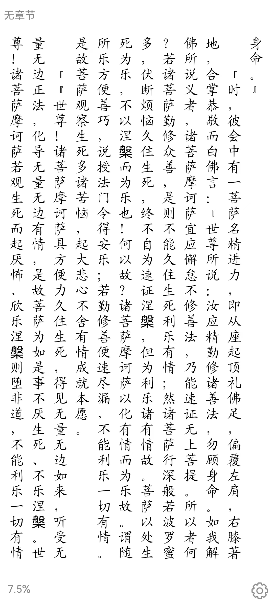
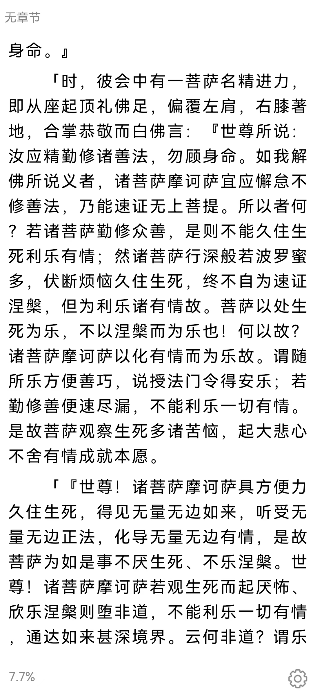

按照旧新排列顺序
**[每日一经v1.2.apk][1]**
**[每日一经v1.3.apk][2]**
**[SutraEverydayV1.4.apk][3]**
**[SutraEveryday_v1.0.1.apk][4]**
**[SutraEveryday_v1.0.2.apk][5]**
**[SutraEveryday_v1.0.3.apk][6]**

  [1]: http://typeecho.trtos.com/blog/typecho/%E6%AF%8F%E6%97%A5%E4%B8%80%E7%BB%8Fv1.2.apk
  [2]: http://typeecho.trtos.com/blog/typecho/app-debug.apk
  [3]: http://typeecho.trtos.com/blog/typecho/SutraEverydayV1.4.apk
  [4]: http://typeecho.trtos.com/blog/typecho/SutraEveryday_v1.0.1.apk
  [5]: http://typeecho.trtos.com/blog/typecho/SutraEveryday_v1.0.2.apk
  [6]: http://typeecho.trtos.com/blog/typecho/SutraEveryday_v1.0.3.apk