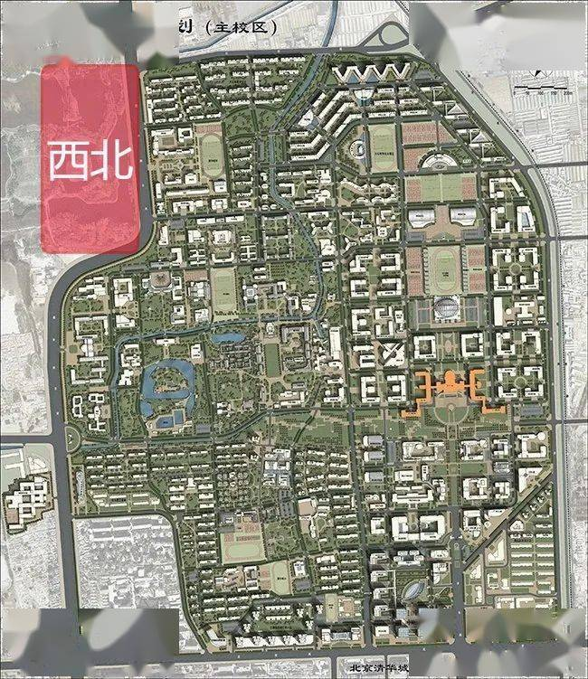
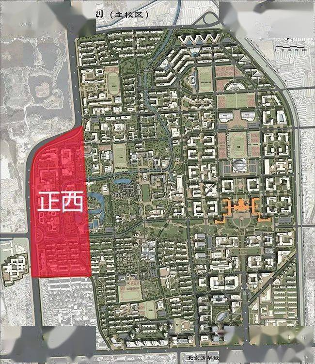
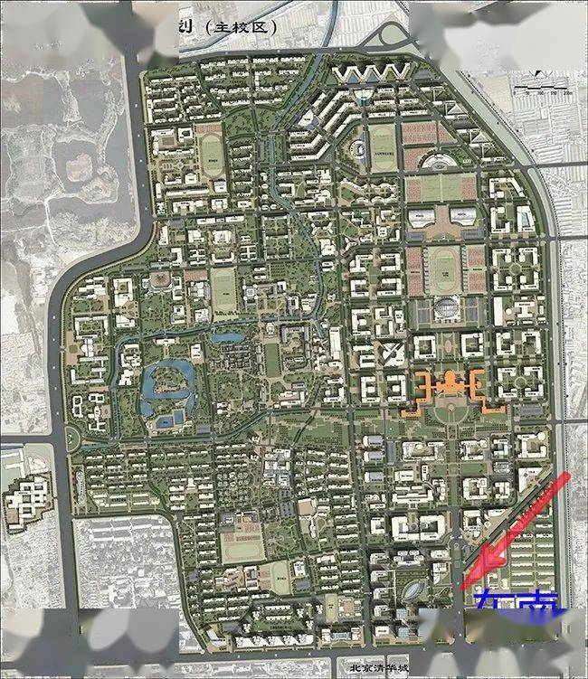

清华作为每年拿国家最多补贴的学校，对国家的科技、国防科技的贡献，却还不如其他知名度小的院校。

难怪网络上把清华大学看成为美国输送人才的基地。

清华大学作为国内一等一的高等学府，如今跌落神坛，除了爱国主义教育缺失等人为内在因素影响外，也受风水环境等外因影响。从清华大学校园园区的风水格局中，可以看出端倪：

一是西北缺陷，爱国主义教育薄弱和政治意识不强。

风水学中，西北方位为乾卦，代表天、君王、权力，管理等意义，从这些意义也可引申为政治意识、国家、爱国主义教育。从清华大学校园区平面图可以看出，西北方向是个湖泊，地势凹陷，风水上是一个不利因素，会导致爱国主义教育薄弱和政治意识不强。

另外，这个位置的缺陷也不利清华大学的校方领导，不利官运。

二是正西凸出，情偏西方。从平面图看，清华大学校区正西凸出，在卦象上，西方为兑卦，西方凸出代表对容易往西方发展，所以清华大学每年都会有很多优秀学生留学西方。

三是文昌位犯煞，名声受损。清华大学主校门在东南方，东南为巽卦，代表文昌位，有利名声名利的传播，也有利学业。

但是从图中看，东南处有一条道路呈东北往西南走向，与整体南北或东西走向的道路不同，显得格外明显，如一刀直砍下来，这个形态属于风水的斜飞水煞，对文昌位产生破坏，反而不利文昌，不利名声传播。

可能，有人会说：校园区一直都是这个样子，为什么以前没有遭人非议呢？

这与气运流转有关，凶星到门才会应验凶事。风水学包括峦头风水和理气风水，二者必须统一，缺一不可。地形缺陷属于峦头风水，主可能发生的事情，而理气风水是可以推算事情发生的时间。

为什么非议质疑在2021年发生呢？

原来，风水学中，大门风水所占比重最大，吉星到门，全局吉利；凶星到门，全局凶险。

2021年五黄都天大煞凶星飞到大门所在的东南方位，五黄是九星之中最凶的星煞，代表病痛、灾难、是非、官非、麻烦、死亡等，加上斜飞水煞，可谓形气俱备，此年应验是非，便是情理之中了。

今年新历10月，流年流月两个五黄凶星到门，凶星叠加，其凶更甚，一切宜谨慎防范！