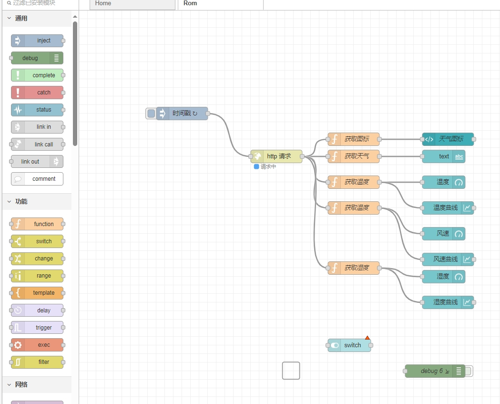
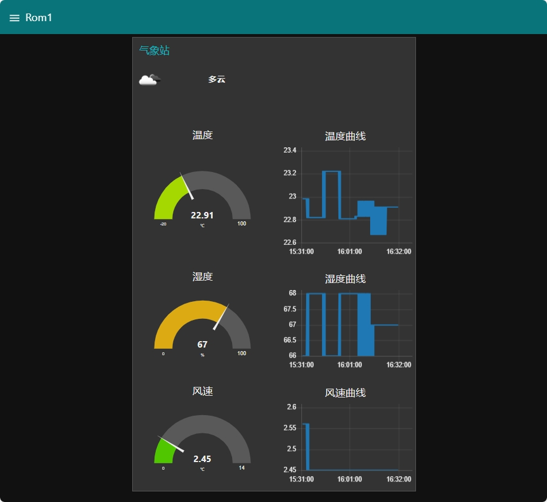

Node-RED是一种编程工具，用于以新颖有趣的方式将硬件设备、API和在线服务连接在一起。

它提供了一个基于浏览器的编辑器，使您可以轻松地使用设计器中的各种节点将流连接在一起，只需单击即可将其部署到其运行，简洁高效的完成一个服务的部署。

基于浏览器的流程编辑
Node-RED提供了一个基于浏览器的流编辑器，可轻松使用面板中的各种节点将流连接在一起。然后，单击即可将流部署到运行时。

可以使用富文本编辑器在编辑器中创建JavaScript函数。

内置库允许您保存有用的功能，模板或流程以供重复使用。

建立在Node.js之上
轻量级运行时基于Node.js构建，充分利用了其事件驱动的非阻塞模型。这使得它非常适合在低成本的硬件（如Raspberry Pi）上的网络边缘以及云中运行。

Node的软件包存储库中有超过225,000个模块，可以轻松扩展面板节点的范围以添加新功能。

生态发展
在Node-RED中创建的流使用JSON存储，可以轻松导入和导出以与他人共享。

在线流程库使您可以与世界分享优秀的节点。

请持续关注我，接下来的一段时间内，我会陆续更新！

NodeRED官网：https://nodered.org/

NodeREDGITHUB：https://github.com/node-red

NodeRED英文社区：https://discourse.nodered.org/

NodeRED中文社区：https://www.iotschool.com/topics/node81

1、先安装nodejs?????? 
 
# Using Ubuntu
curl -sL https://deb.nodesource.com/setup_8.x | sudo -E bash -
sudo apt-get install -y nodejs
2、使用npm安装node-red 
sudo npm install -g --unsafe-perm node-red
成功的话显示 

node-red@1.1.0
added 332 packages from 341 contributors in 18.494s
found 0 vulnerabilities
3、启动
$ node-red

言归正传  我们用他来做一个气象站  先去申请 api 以便获取天气信息

https://api.openweathermap.org/data/2.5/weather?q=Shenzhen,cn&lang=zh_cn&appid=e713f553026dbf4f7f269c61e936338f
拖拖拽拽 

显示
