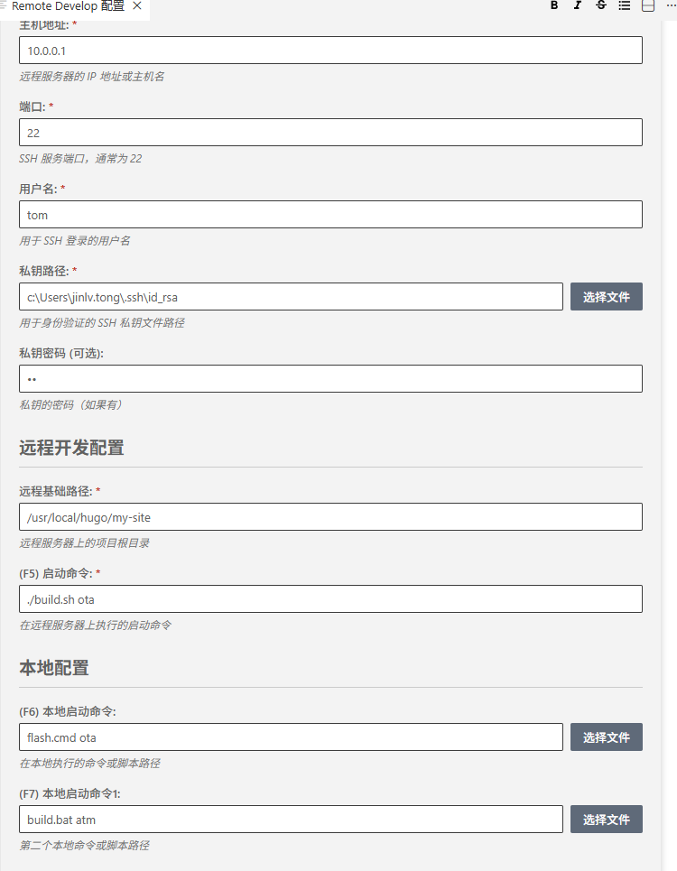

Remote Dev Assistant - VS Code 插件
🚀 自动同步本地文件到远程服务器 + 一键执行远程命令，提升远程开发效率，交叉开发利器，跨平台开发神器！

功能亮点
🔄 实时文件同步 - 本地文件修改后自动上传到远程服务器
⚡ 一键执行远程命令 - 按 F5 快速运行服务器上的脚本/程序
📜 终端输出集成 - 直接在 VS Code 输出面板查看远程执行结果
🔒 SSH 密钥支持 - 安全连接，无需频繁输入密码
🎛️ 无配置不占用快捷键 - 无配置文件 .vscode/config.json 时插件处于静默状态
⚡ 命令执行
快捷键	功能说明	配置项
F5	执行远程命令	runCommand
F6	执行本地主命令	localCommand
F7	执行本地备用命令	localCommand1
🛠️ 其他功能
SSH终端集成 - 内置完整的SSH终端支持
多环境配置 - 支持不同项目独立配置
执行历史 - 记录最近执行的命令记录
断线重连 - 网络中断自动恢复机制
快速开始
1. 安装插件
在 VS Code 扩展商店搜索 "RemoteDev" 并安装。

2. 配置 SSH 连接
在项目 .vscode/config.json 中添加你的服务器信息：

{
  "ssh": {
    "host": "your-server-ip",          //远程服务器域名或者ip 
    "port": 22,                        //远程服务器登录端口
    "username": "your-username",       //远程服务器登录名
    "privateKeyPath": "~/.ssh/id_rsa"  // 远程服务器私钥
  },
  "remoteBasePath": "/home/your-username/project",  // 远程服务器路径
  "runCommand": "make",                   // 按 F5 执行的命令
  "runCommand": "./build.cmd",             // 按F6 执行本地命令 
  "localCommand": "flash.cmd"              // 按F7 执行本地命令 
}
### 3. 开始开发
- 保存文件即可自动同步到远程服务器
- 按 `F5` 执行远程命令
- 按 `F6`/`F7` 执行本地命令
- 在输出面板查看执行结果

## 支持
如有问题或建议，请访问我们的 [GitHub 仓库](https://github.com/tongjinlv/remote-develop.git)。

---
**享受无缝远程开发体验！** 🎉

